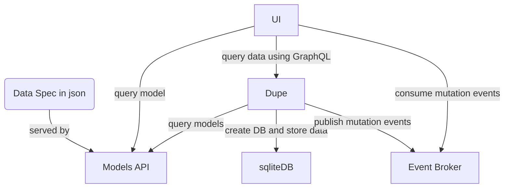

# Perry

Perry was used as a testing site to explore entity relationship concepts.

## How it works

1. Write a JSON file specifying the entities and relationships, looking like [data.json](demo/data.json).
1. Create JSON schemas from the spec.
1. Create SQL schemas from the spec.
1. Create GraphQL schemas from the spec.
1. Use a generic UI to create/read/updeate objects (folder [ui](ui/)).

Perry includes:
* Models API to simply serve the spec mentioned above ([models](models/)).
* a shared internal library ([perrydl](perrydl)) in Typescript and Rust (WASM) that:
  * generates SQL schema from the spec
  * generates GraphQL schemas from spec
  * generates JSON schemas from the spec
* Dupe API ([dupe](dupe/)) which is an extremely unoptimized backend that:
  * queries the model from Models API
  * uses [perrydl](perrydl) to generate SQL schema, GraphQL schema and JSON schemas from the spec
  * bootstraps a sqliteDB using the generated SQL
  * serves a GraphQL API using the generated GraphQL schema (to serve and mutate the data in the sqliteDB)
  * uses JSON schemas to validate input data
  * allows bulk insert and update using CSVs
  * captures data changes and sends to an in-memory [event-broker](https://gitlab.com/pedrocalado/mrbig/-/tree/main/examples/event-broker) (gRPC-Web)
* A user interface in Typescript+React+Recoil [ui](ui/)
  * queries Models API to create entity relationship internal representation
  * allows exploring entities using a graph like structure
  * generates forms to create data objects
  * uses tables and filters to present data objects
  * listens to events served by an in-memory [event-broker](https://gitlab.com/pedrocalado/mrbig/-/tree/main/examples/event-broker) (gRPC-Web)

## Bugs and limitations

Perry is not production ready and should not be used in a production environment, it's just exploration:
- search by text is flawed and applies to first column only
- gRPC stream lacks keep alive
- gear icon on text search is useless
- items cannot be dragged & dropped even though there are drop zones
- sessions are volatile, if you reload tabs are lost
- mutation events published by dupe are meant as a "poor man's CDC" but are not consistent (if dupe fails to publish them, they won't be retried)
- the event broker is an in-memory broker with short-lived historic data
- changing fields which are unique yields cryptic errors

This project is not being actively maintained.

# Demo

Go to https://perry-demo.pages.dev and use the credentials:
* user: demo@demoperry12345.perry
* password: 1veryrandomPassword4perry

The demo is fairly limited:
- data resets every hour
- data sample does not explore all entities and relations in the data spec
- backend requests are rate limited to prevent abuse
- app is halted if high network traffic is detected
- translation to de_DE comes straight from https://translate.i18next.com/